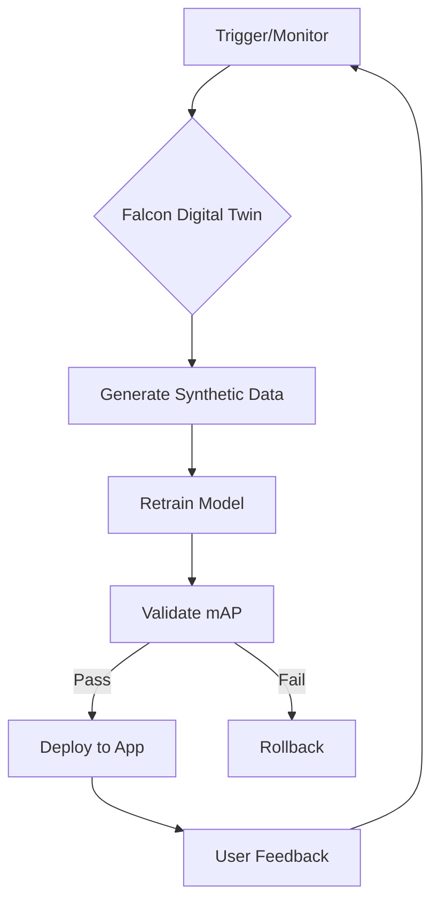

# Continuous Model Update Plan (Falcon Integration)

## Retraining Triggers
- New object variant (e.g., redesigned Toolbox)
- mAP@0.5 drops by >10% on validation
- Environmental change (e.g., new lighting, Mars mission)

## Falcon Configuration Example
```python
# Falcon API pseudo-code
falcon.generate_dataset(
    objects=["Oxygen Tank v2", "Multi-tool Kit"],
    lighting="low_gravity_sunlight",
    occlusion=0.6
)
```

## Automation Workflow
1. **Trigger**: Detect need for retraining (scheduled or event-based)
2. **Synthetic Data Generation**: Falcon simulates new scenarios
3. **Retraining**: Automated YOLOv8 training pipeline
4. **Validation**: Ensure mAP@0.5 > 75%
5. **OTA Update**: Push new weights to app
6. **Rollback**: Revert to previous model if validation fails

## CI/CD Pipeline Diagram


## Rollback Strategy
- Keep previous model weights as backup
- If validation fails, restore last known good model
- Log all update events and validation results 